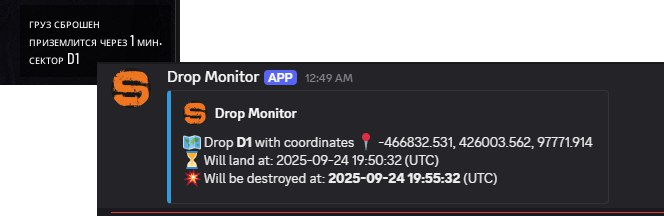

# SCUM Drop Tracker

## What is this?

A simple tool that monitors SCUM server logs and sends notifications about cargo drops (live time) to a Discord channel. Supports Russian and English languages.

---

## Prerequisites

- Python 3.10 or later is required.
- [Download Python](https://www.python.org/downloads/).

### How to add Python to PATH (Windows)

- When installing Python, make sure to check the box **"Add Python to PATH"**.
- If you missed it, you can add Python to PATH manually via System Environment Variables.

---

## Setting up a Virtual Environment (Recommended)

To avoid conflicts between Python packages, it's best to create a virtual environment.

1. Open Command Prompt or PowerShell.
2. Navigate to the project folder:

    ```
    cd path\to\project
    ```

3. Create a virtual environment (you can name it `venv`):

    ```
    python -m venv venv
    ```

4. Activate the virtual environment:

    - PowerShell:

        ```
        .\venv\Scripts\Activate.ps1
        ```

    - Command Prompt:

        ```
        .\venv\Scripts\activate.bat
        ```

You will see `(venv)` prefix in your terminal prompt, meaning the virtual environment is activated.

5. Install required dependencies:

    ```
    pip install -r requirements.txt
    ```

6. Configure Environment Variables
Copy `.env.example` to `.env` and update as needed:
```
LOG_PATH=path_to_your_log_file.log
DISCORD_WEBHOOK_URL=your_discord_webhook_url
APP_LANGUAGE=ru
SERVER_PROCESS_NAME=SCUMServer.exe
CHECK_INTERVAL=10
SERVER_CONFIG_PATH=path_to/ServerSettings.ini
```
---

## Running the Script Manually or Automatically

```
python main.py
```

## How to Change Message Language

The tracker supports Russian (`ru`) and English (`en`).

Open the `.env` file and set:

 ```
APP_LANGUAGE=ru
```

or
```
APP_LANGUAGE=en
```

Save `.env` and restart the tracker.

The code is written by AI.

